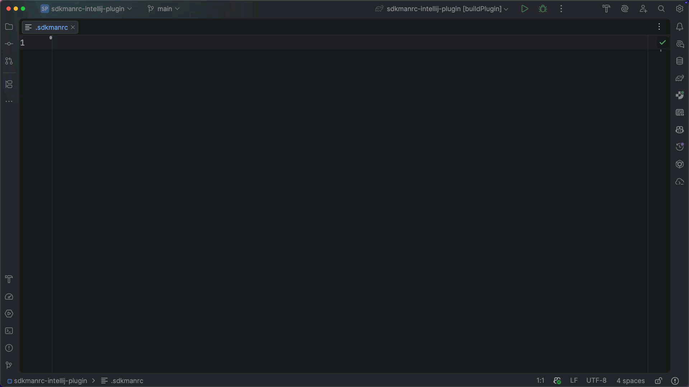

# SDKMAN IntelliJ IDEA Plugin
An IntelliJ IDEA Plugin to provide auto-completion in `.sdkmanrc` file.

> [!NOTE]
> Currently, only a predefined set of SDKs are supported and shows only the locally downloaded versions.
> Supported SDKs: java, maven, mvnd, gradle, kotlin, groovy, scala, springboot, quarkus

## Installation
This plugin is published in the JetBrains Marketplace https://plugins.jetbrains.com/plugin/30654-sdkman.

You can also install it manually by downloading the plugin from the [releases page](https://github.com/sivaprasadreddy/sdkmanrc-intellij-plugin/releases) and installing it via the IntelliJ IDEA plugin manager.

1. Go to Settings → Plugins
2. Click on the cog icon and select the "Install Plugin from Disk" option
3. Select the downloaded plugin zip file from the releases page

## Usage
1. Open your `.sdkmanrc` file in IntelliJ IDEA.
2. Start typing the name of the SDK you want to configure.
3. Use the auto-completion feature to select the desired SDK version.

For more information on SDKMAN, refer to the [official documentation](https://sdkman.io/).
